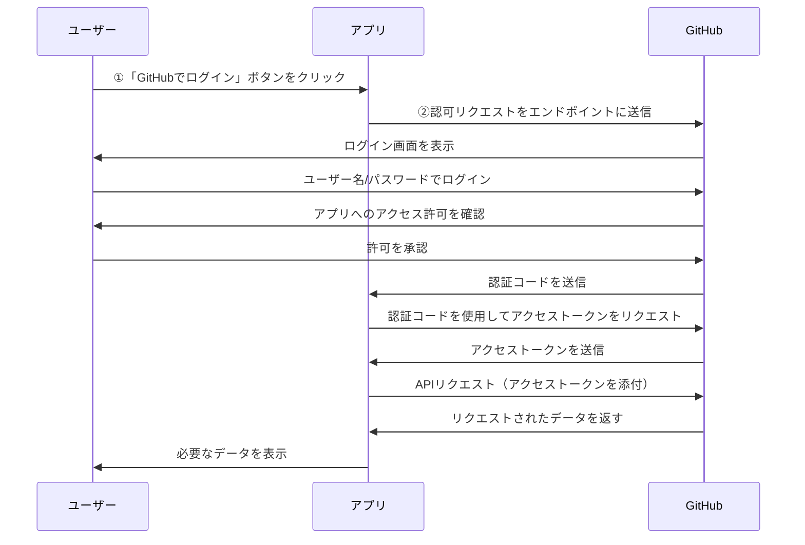
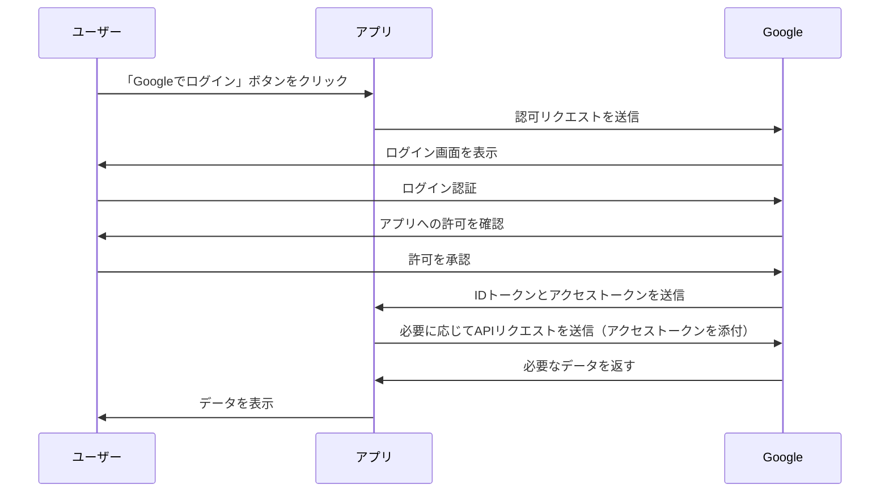

これは「Happiness Chain Advent Calendar 2024」の 11 日目の記事です。
https://adventar.org/calendars/10341

## はじめに

現在、Django を使って Twitter クローンを作成しており、その中で GitHub ログイン機能を実装しました。しかし、どのような仕組みでログインが成り立っているのかがよく分からなかったため、本記事ではその基本的な仕組みを理解するために学んだ内容を整理し、紹介したいと思います。

:::message
専門的な解説ではないので、もしかすると間違った表現をしている可能性があります。
:::

## そもそも OAuth とは？

こちらの記事がとてもわかりやすいので、一度読むことをおすすめします！

https://qiita.com/TakahikoKawasaki/items/e37caf50776e00e733be

**OAuth**（**=Open Authorization**）とは、アプリや Web サービスがユーザーのデータや機能にアクセスできるようにする仕組みです。具体的には下記のようなことを OAuth で実現できます。

- 自身の Google アカウントを使って、他のアプリケーションにログインする
- 外部サービスから X の API を通じて、特定ユーザーのポストやメッセージを取得する
- Slack 連携して、ユーザーが指定したチャンネルに対して通知やメッセージを送信する

ここで重要なのが OAuth は「**認可**」の仕組みであるということです。
似た表現に「**認証**」がありますが、意味は全く異なっているので注意してください。

- **認可（Authorization）**: 他のサービスやアプリのデータや機能へのアクセスを許可すること
- **認証（Authentication）**: ユーザーの身元（誰であるか）を確認すること

https://zenn.dev/tanaka_takeru/articles/aecd36a805886d

もし「**認証**」を行う場合には **OpenID Connect** という拡張仕様が使われます。
OpenID Connect を使うことで、ユーザーが誰であるか（認証）も確認できるようになります。

https://qiita.com/TakahikoKawasaki/items/498ca08bbfcc341691fe

## OAuth の仕組み

### OAuth と OpenID Connect の比較

|                    | OAuth2.0                          | OpenID Connect                   |
| ------------------ | --------------------------------- | -------------------------------- |
| **目的**           | 認可 （リソースの使用を許可する） | 認証（ユーザーが誰かを確認する） |
| **トークンの種類** | アクセストークン                  | アクセストークン・ID トークン    |
| **トークンの用途** | API へのアクセス権を提供          | 認証情報をクライアントに提供     |

## GitHub ログインについて

GitHub ログインの場合、**基本的には OAuth のみで認証が完結します**。
GitHub は、ユーザーにアクセスを許可するための OAuth フローを使用し、認証情報はアプリ側で別途確認しません。

## Google 認証について

## おわりに

本記事では、ソーシャル認証と OAuth の仕組みの基本について、説明しました。
OAuth 自体、すべてを理解しようとすると奥が深い分野ですが、全体像さえ理解できれば、ソーシャル認証を実装する際のなどで活かせる場面があるなと感じました。これからももっと理解を深めていきたいです。

ここまで読んでいただきありがとうございます！

## 参考

https://apidog.com/jp/blog/github-oauth-2-process/
