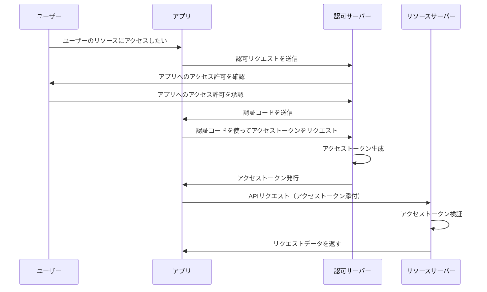
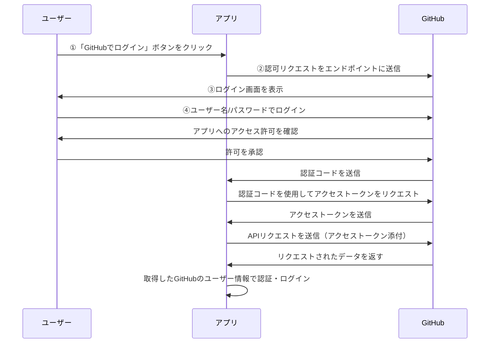

これは「Happiness Chain Advent Calendar 2024」の 11 日目の記事です。
https://adventar.org/calendars/10341

## はじめに

現在、Django を使って Twitter クローンを作成しており、その中で GitHub ログイン機能を実装しました。しかし、どのような仕組みでログインが成り立っているのかがよく分からなかったため、本記事ではその基本的な仕組みを理解するために学んだ内容を整理し、紹介したいと思います。

:::message
専門的な解説ではないので、もしかすると間違った表現をしている可能性があります。
:::

## そもそも OAuth とは？

こちらの記事がとてもわかりやすいので、一度読むことをおすすめします！

https://qiita.com/TakahikoKawasaki/items/e37caf50776e00e733be

**OAuth**（**=Open Authorization**）とは、アプリや Web サービスがユーザーのデータや機能にアクセスできるようにする仕組みです。例えば、下記のようなことを OAuth で実現できます。

- 自身の GitHub アカウントを使って、他のアプリケーションにログインする
- 外部サービスから X の API を通じて、特定ユーザーのポストやメッセージを取得する
- Slack 連携して、ユーザーが指定したチャンネルに対して通知やメッセージを送信する

ここで重要なのが OAuth は「**認可（Authorization）**」の仕組みであるということです。
似た表現に「**認証（Authentication）**」がありますが、意味は全く異なるので注意してください。

- **認証（Authentication）**: ユーザーが誰であるかを確認すること
- **認可（Authorization）**: 他のサービスやアプリのデータや機能へのアクセスを許可すること

https://zenn.dev/tanaka_takeru/articles/aecd36a805886d

もし「**認証**」を行う場合には **OpenID Connect** という拡張仕様が使われます。
本記事では取り扱いませんが、OpenID Connect を使うことで、ユーザーが誰であるか（認証）も確認できるため、OAuth と合わせて使う場面がある仕組みでもあります。下記記事が参考になるかと思います。

https://qiita.com/TakahikoKawasaki/items/498ca08bbfcc341691fe

## OAuth の仕組み

OAuth の基本的な流れは次のようになります：

1. ユーザーがアプリケーションで外部サービス（例えば GitHub など）を選択
2. アプリが認可サーバー（GitHub など）にリダイレクトし、ユーザーにアクセスを許可するよう促す
3. ユーザーがログインし、アクセスを許可
4. アプリは認証コードを受け取り、それを使ってアクセストークンを取得
5. アプリがアクセストークンを使って API リクエストを行い、データにアクセス

### OAuth の認可コードフロー（Authorization Code Flow）

### GitHub ログインのフロー

GitHub ログインの場合、**基本的には OAuth のみで認証が完結します**。
ここで特徴的なのは、GitHub サーバーが認可サーバー&リソースサーバーの両方の役割を担っていることです。
GitHub は、ユーザーにアクセスを許可するための OAuth フローを使用し、認証情報はアプリ側で別途確認しません。

https://zenn.dev/takamin55/articles/538711ed6fd48d#%E5%BE%85%E3%81%A6%E3%80%82oauth%E3%81%A3%E3%81%A6%E3%83%AD%E3%82%B0%E3%82%A4%E3%83%B3%E3%81%AE%E6%89%8B%E6%AE%B5%E3%81%A7%E3%81%AF%EF%BC%9F%E3%81%A4%E3%81%BE%E3%82%8A%E8%AA%8D%E8%A8%BC%E3%81%A7%E3%81%AF%EF%BC%9F

## おわりに

本記事では、ソーシャル認証と OAuth の仕組みの基本について、説明しました。
OAuth 自体、すべてを理解しようとすると奥が深い分野ですが、全体像さえ理解できれば、ソーシャル認証を実装する際のなどで活かせる場面があるなと感じました。これからももっと理解を深めていきたいです。

ここまで読んでいただきありがとうございます！

## 参考

https://qiita.com/TakahikoKawasaki/items/e37caf50776e00e733be
https://zenn.dev/takamin55/articles/538711ed6fd48d
