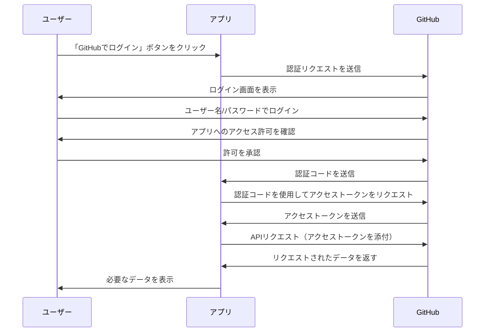
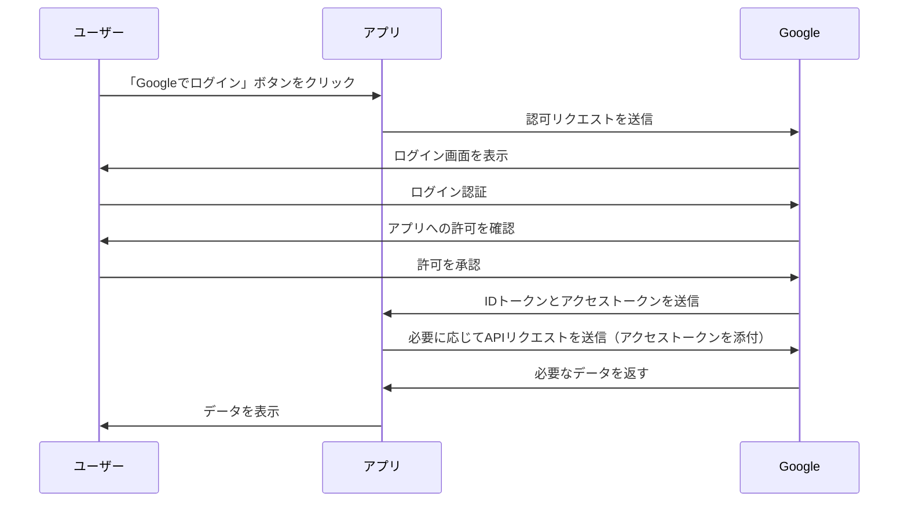

これは「Happiness Chain Advent Calendar 2024」の 11 日目の記事です。
https://adventar.org/calendars/10341

## はじめに

現在 Django を使った Twitter クローン作成に取り組んでおり、Github 認証を実装する場面がありました。実装自体はできたものの、どんな仕組みで成り立っているのかよく分からなかったので、基本的な仕組みを理解したいと思ったのが本記事を書くに至った経緯です。

:::message
専門的な解説ではないので、もしかすると間違った表現をしている可能性があります。
:::

## そもそも OAuth ってなに？

OAuth とは Open Authorization の略であり、

OAuth は現在、Google、X、Facebook、Microsoft など多くのプロバイダーによってサポートされているため、何かしらのサービスにログインする際使われることが多いです。

下記がとてもわかりやすいので、事前に読むことをおすすめします！

https://qiita.com/TakahikoKawasaki/items/e37caf50776e00e733be

- aaa
- aaa
- aaa

ここで重要なのが、OAuth は「**認可**」に特化した仕組みだということです。
似た表現に「**認証**」がありますが、意味がことなっています。

### 認可と認証

OAuth が認可

- 認可：
- 認証：あああああ

### OAuth と OpenID Connect の比較

|          | OAuth2.0 | OpenID Connect                       |
| -------- | -------- | ------------------------------------ |
| **目的** | 認可     | 認証（この人が誰であるかを確認する） |
| A2       | B2       | C2                                   |
| A3       | B3       | C3                                   |

## GitHub 認証について

Github 認証において、OAuth と OpenID Connect がどのように関係しているかを見ていく。

## Google 認証について

## おわりに

本記事では、ソーシャル認証と OAuth の仕組みの基本について、説明しました。
OAuth 自体、すべてを理解しようとすると奥が深い分野ですが、全体像さえ理解できれば、ソーシャル認証を実装する際のなどで活かせる場面があるなと感じました。これからももっと理解を深めていきたいです。

ここまで読んでいただきありがとうございます！

## 参考

https://apidog.com/jp/blog/github-oauth-2-process/
