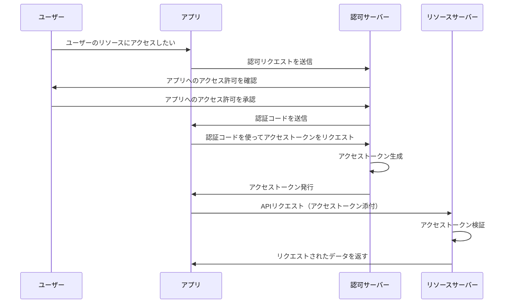
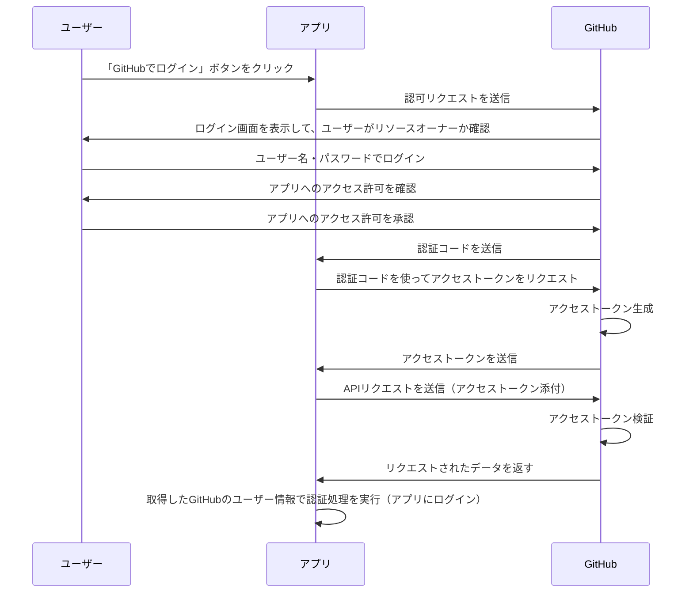

これは「Happiness Chain Advent Calendar 2024」の 11 日目の記事です。
https://adventar.org/calendars/10341

## はじめに

現在、Django を使った Twitter クローンアプリを作成しており、その中で GitHub ログイン機能を実装する機会がありました。実装自体はできたものの、「**OAuth**」 と呼ばれる仕組みが何をしているのかよくわかりませんでした。そこで本記事では、OAuth の基本的な仕組みと GitHub ログインがどのように OAuth を活用しているかを紹介しようと思います。

:::message
この記事は、初心者向けに OAuth の概要をわかりやすく説明することを目的としています。
正確な仕様や詳細を知りたい方は、[ドキュメント](https://datatracker.ietf.org/doc/html/rfc6749)や専門書をご参照ください。
:::

## OAuth って何？

こちらの記事がとてもわかりやすいので、まずは一度読むことをおすすめします！

https://qiita.com/TakahikoKawasaki/items/e37caf50776e00e733be

**OAuth**（**Open Authorization**）とは、**アプリやサービスがユーザーデータや機能に安全にアクセスできるようにする仕様**のことです。

例えば、以下のような場面で利用されています。

- Google アカウントを使って、他のアプリケーションにログインする
- 外部サービスから X の API を通じて、特定ユーザーのプロフィールやポストを取得する
- Slack と連携して、ユーザーが指定したチャンネルに対して通知を送信する

## OAuth は『認可』のプロトコルである

ただし、OAuth はあくまで「**認可（Authorization）**」に焦点を当てたプロトコルです。
似た表現に「**認証（Authentication）**」がありますが、両者は異なる概念なので注意して下さい。
OAuth を使う上では、この違いを理解することが重要です。

- **認証（Authentication）**:「あなたは誰ですか？」を確認するプロセス
- **認可（Authorization）**:「このアプリがこのデータにアクセスするのを許可しますか？」を管理するプロセス

https://zenn.dev/tanaka_takeru/articles/aecd36a805886d

もし「**認証**」を取り扱う場合には、**OpenID Connect** という OAuth の拡張仕様が使用されます。
本記事では触れませんが、OpenID Connect を使うことで、**ユーザーが誰であるかの確認** もできるため、OAuth と組み合わせて認証と認可を実現するケースもあるようです。

https://qiita.com/TakahikoKawasaki/items/498ca08bbfcc341691fe

## OAuth の仕組みについて

それでは OAuth の仕組みを具体的に見ていきましょう。

### OAuth の構成要素

[OAuth は以下 4 つの要素で構成されています。](https://openid-foundation-japan.github.io/rfc6749.ja.html#anchor2)

| 要素                              | 説明                                                       |
| --------------------------------- | ---------------------------------------------------------- |
| **リソースオーナー（=ユーザー）** | 保護されたリソース（ユーザーデータ）を所有しているユーザー |
| **リソースサーバー**              | 保護されたリソースを格納し、それを API で提供するサーバー  |
| **認可サーバー**                  | ユーザーのアクセス許可を管理するサーバー                   |
| **クライアント（=アプリ）**       | リソースオーナー認可の下、リソースを要求するアプリ         |

上記に加え、もう一つ「[**アクセストークン**](https://openid-foundation-japan.github.io/rfc6749.ja.html#anchor8)」という重要なものがあります。
これは「**認可サーバーがアプリに発行する一時的な鍵**」のようなもので、アプリはこれを利用してリソースサーバー上の保護されたリソースに安全にアクセスできるのです。

### OAuth のフローについて

次に、OAuth の構成要素がどのような役割を果たしているか、実際のフローを見ていきます。
[OAuth のフローは複数あります](https://qiita.com/TakahikoKawasaki/items/200951e5b5929f840a1f#1-%E8%AA%8D%E5%8F%AF%E3%82%B3%E3%83%BC%E3%83%89%E3%83%95%E3%83%AD%E3%83%BC)が、今回は標準的なフローである「**認可コードフロー（Authorization Code Flow）**」を紹介します。

以下の 4 ステップで行われます。

1. **アプリが認可リクエストを送信**

   - ユーザーがアプリを使って外部リソースへアクセスするために、
     アプリは認可サーバーに対して、アクセス許可をもらうためのリクエストを送信します。

2. **ユーザーがアクセス許可を承認**

   - 認可サーバーは、ユーザーに対してアプリへのアクセス許可を要求します。
     ユーザーがこれを承認すると、認可サーバーは「認証コード」をアプリに送信します。

3. **アプリがアクセストークンを取得**

   - アプリは認証コードを使って、認可サーバーからアクセストークンを受け取ります。

4. **リソースサーバーへリクエストを送信**
   - アプリはアクセストークンを使ってリソースサーバーに API リクエストを送信し、必要なデータを取得します。

フローを図示すると、以下のようになります。

https://openid-foundation-japan.github.io/rfc6749.ja.html

### GitHub ログインと OAuth の関係

ここまでで OAuth のフローがなんとなく理解できたかと思います。
では **GitHub ログイン**を例に、これに OAuth がどのように関わっているかを見ていきましょう。

ただその前に、こう疑問に思った方がいるかもしれません。

> **そういえば OAuth って『認可』のプロトコルだよね？？GitHub ログインって聞くと、
> ユーザーが誰かを確認するステップだから、どちらかというと『認証』なのでは？？**

[こちらの方の記事](https://zenn.dev/takamin55/articles/538711ed6fd48d#%E5%BE%85%E3%81%A6%E3%80%82oauth%E3%81%A3%E3%81%A6%E3%83%AD%E3%82%B0%E3%82%A4%E3%83%B3%E3%81%AE%E6%89%8B%E6%AE%B5%E3%81%A7%E3%81%AF%EF%BC%9F%E3%81%A4%E3%81%BE%E3%82%8A%E8%AA%8D%E8%A8%BC%E3%81%A7%E3%81%AF%EF%BC%9F)でも同様なことが言及されていますが、GitHub ログインのどこに
OAuth の認可フローが取り入れられているのか、自分は最初イメージができませんでした。

これを理解するために、OAuth を構成する 4 つの要素に、実際の登場人物を当てはめてみます。

| 要素                        | GitHub ログインにおける登場人物                            |
| --------------------------- | ---------------------------------------------------------- |
| **リソースオーナー**        | GitHub アカウントを所有するユーザー                        |
| **リソースサーバー**        | GitHub（=GitHub のリソース取得する API）                   |
| **認可サーバー**            | GitHub（=GitHub の認可エンドポイント）                     |
| **クライアント（=アプリ）** | Twitter クローンアプリ（※GitHub ログインを実装するアプリ） |

特徴的なのは、**GitHub が認可サーバーとリソースサーバーの両方の役割を担っている**ことです。これにより、アプリは認可フローを通じて取得したアクセストークンで、GitHub API から直接ユーザー情報を取得できます。そのため、アプリ側で認証処理を挟まなくても、取得したユーザー情報をもとにログイン（認証）できるのです。

つまり、**GitHub ログインは OAuth の「認可」フローを経由して、結果的に「認証」を実現している**のです。それを踏まえると、先程の疑問も解決するのではないでしょうか？
GitHub ログインは「認可」のプロセスを通っているのです。

以下は GitHub ログインのフロー図です。

## おわりに

本記事では、OAuth の仕組みと それが GitHub ログインにどのように関係しているかを、
説明しました。OAuth 自体理解しようとすると奥が深い技術ですが、全体像だけでも理解できれば、今後の開発で認可を必要とするを実装で活かせる場面があると感じました。今後もいろいろ調べて見たいと思います。

最後まで、読んでいただきありがとうございました！

## 参考サイト

https://qiita.com/TakahikoKawasaki/items/e37caf50776e00e733be
https://envader.plus/article/294
https://docs.github.com/ja/enterprise-cloud%40latest/apps/creating-github-apps/writing-code-for-a-github-app/building-a-login-with-github-button-with-a-github-app
https://www.ibm.com/jp-ja/think/topics/oauth
https://openid-foundation-japan.github.io/rfc6749.ja.html#anchor2
