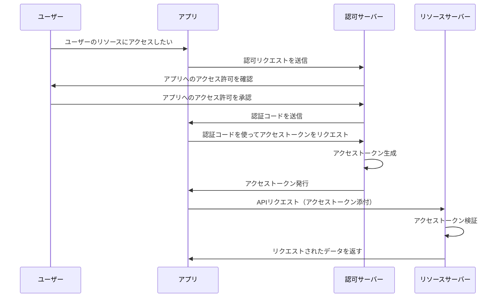
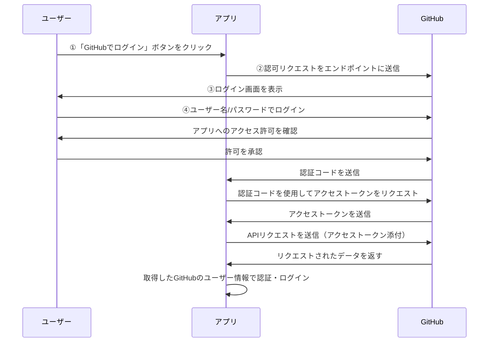

これは「Happiness Chain Advent Calendar 2024」の 11 日目の記事です。
https://adventar.org/calendars/10341

## はじめに

現在、Django を使った Twitter クローンアプリを作成しており、その中で GitHub ログイン機能を実装する機会がありました。実装自体はできたものの、「**OAuth**」 と呼ばれる仕組みが何をしているのかよくわかりませんでした。そこで本記事では、OAuth の基本的な仕組みと GitHub ログインがどのように OAuth を活用しているかを紹介しようと思います。

:::message
専門的な解説ではないので、間違った表現をしている可能性があります。
OAuth に関して、詳しい内容を知りたい方は専門書や[ドキュメント](https://datatracker.ietf.org/doc/html/rfc6749)を読むことを推奨します。
:::

## OAuth って何？

こちらの記事がとてもわかりやすいので、まずは一度読むことをおすすめします！

https://qiita.com/TakahikoKawasaki/items/e37caf50776e00e733be

**OAuth**（**Open Authorization**）とは、
**アプリやサービスが、ユーザーのデータや機能に安全にアクセスできるようにする仕様**のことです。

OAuth の使用例としては以下のようなものが挙げられます。

- Google アカウントを使って、他のアプリケーションにログインする
- 外部サービスから X の API を通じて、特定ユーザーのプロフィールやポストを取得する
- Slack と連携して、ユーザーが指定したチャンネルに対して通知を送信する

### OAuth は『認可』のプロトコルである

ただし、OAuth はあくまで、「**認可（Authorization）**」に焦点を当てたプロトコルです。
似たような表現に「**認証（Authentication）**」があり、両者は混同されやすいですが、異なる概念なので注意してください。

- **認証（Authentication）**: ユーザーが誰であるかを確認するプロセス
- **認可（Authorization）**: 他のサービスやアプリのデータや機能へのアクセスを許可するプロセス

https://zenn.dev/tanaka_takeru/articles/aecd36a805886d

もし「**認証**」を取り扱う場合には、**OpenID Connect** という OAuth の拡張仕様が使用されます。
本記事では触れませんが、OpenID Connect を使うことで、**ユーザーが誰であるかの確認** もできるため、OAuth と組み合わせて認証と認可を実現するケースがあります。OpenID Connect に興味のある方は下記記事を読むと、理解が深まるかと思います！

https://qiita.com/TakahikoKawasaki/items/498ca08bbfcc341691fe

## OAuth の仕組みについて

それでは OAuth の仕組みを具体的に見ていきましょう。

### OAuth の構成要素

OAuth は以下 4 つの要素で構成されています。
| 要素 | 説明 |
| -------------------------------- | --------------------------------------------- |
| **リソースオーナー** | データを所有しているユーザー |
| **アプリ** | リソースオーナーが利用するアプリケーション |
| **認可サーバー** | ユーザーのアクセス許可を管理するサーバー |
| **リソースサーバー** | ユーザーデータを格納し、API を提供するサーバー |

さらに、もう一つ重要なキーワードとして「**アクセストークン**」というものがあります。
これは認可サーバーがアプリに対して発行するものであり、これを使ってリソースサーバ上の特定のリソースにアクセスします。
「**アプリがリソースに安全にアクセスするための一時的な鍵**」とイメージすると分かりやすいかと思います。

### OAuth のフローについて

次に、OAuth の各構成要素がどのような役割を果たしているか、実際のフローで見ていきます。
[OAuth のフローは複数あります](https://qiita.com/TakahikoKawasaki/items/200951e5b5929f840a1f#1-%E8%AA%8D%E5%8F%AF%E3%82%B3%E3%83%BC%E3%83%89%E3%83%95%E3%83%AD%E3%83%BC)が、今回は標準的なフローである「**認可コードフロー（Authorization Code Flow）**」を紹介します。

以下の 4 ステップで行われます。

1. **アプリが認可リクエストを送信する**

   - ユーザーがアプリを使って外部リソースへアクセスするために、
     アプリは認可サーバーに対して、アクセス許可をもらうためのリクエストを送信します。

2. **ユーザーがアクセス許可を承認する**

   - 認可サーバーは、ユーザーに対してアプリへのアクセス許可を要求します。
     ユーザーがこれを承認すると、認可サーバーは「認証コード」をアプリに送信します。

3. **アプリがアクセストークンを取得する**

   - アプリは認証コードを使って、認可サーバーからアクセストークンを受け取ります。

4. **リソースサーバーへリクエストを送信する**
   - アプリはアクセストークンを使ってリソースサーバーに API リクエストを送信し、必要なデータを取得します。

上記フローを図示すると、以下のようになります。

### GitHub ログインと OAuth の関係

では GitHub ログインを例にして、OAuth フロー がどう関わっているかを見ていきます。
その前に、こう疑問に思った方がいるかもしれません。私はそうでした。

> **そういえば OAuth って『認可』のプロトコルだよね？？GitHub ログインって聞くと、
> ユーザーが誰かを確認するステップだから、どちらかというと『認証』なのでは？？**

[こちらの方の記事](https://zenn.dev/takamin55/articles/538711ed6fd48d#%E5%BE%85%E3%81%A6%E3%80%82oauth%E3%81%A3%E3%81%A6%E3%83%AD%E3%82%B0%E3%82%A4%E3%83%B3%E3%81%AE%E6%89%8B%E6%AE%B5%E3%81%A7%E3%81%AF%EF%BC%9F%E3%81%A4%E3%81%BE%E3%82%8A%E8%AA%8D%E8%A8%BC%E3%81%A7%E3%81%AF%EF%BC%9F)でも同様なことが言及されていますが、GitHub ログインのどこに
OAuth の認可フローが取り入れられているのか最初はイメージができませんでした。

これについて解説するには、
まず先程説明した、OAuth を構成する 4 要素に、登場人物を当てはめてみます。

| 要素                 | GitHub ログインにおける登場人物                            |
| -------------------- | ---------------------------------------------------------- |
| **リソースオーナー** | GitHub アカウントを所有するユーザー                        |
| **アプリ**           | Twitter クローンアプリ（※GitHub ログインを実装するアプリ） |
| **認可サーバー**     | GitHub（=GitHub の認可エンドポイント）                     |
| **リソースサーバー** | GitHub（=GitHub の API）                                   |

ここで特徴的なのは、GitHub が**認可サーバーとリソースサーバーの両方の役割を担っている**ことです。そのため、認可フローを通じてアクセストークンを取得するだけで、ユーザー情報（例: ユーザー名、メールアドレス）をリソースサーバーから直接取得できます。これにより、アプリ側で認証処理を挟まなくてもログインできるのです。

つまり、**GitHub ログインは OAuth がもたらす「認可」により「認証」を実現する**といえるのです。そういう意味では、GitHub ログインは OAuth と大きく関わっているのです。

以下、フロー図です。

## おわりに

本記事では、OAuth の仕組みの基本について、説明しました。
OAuth はすべてを理解しようとすると奥が深い技術ですが、全体像だけでも理解できれば、ソーシャル認証を実装する際に活かせる場面があると感じました。今後も
最後まで、読んでいただきありがとうございました！

## 参考サイト

https://qiita.com/TakahikoKawasaki/items/e37caf50776e00e733be
https://www.ibm.com/jp-ja/think/topics/oauth
https://openid-foundation-japan.github.io/rfc6749.ja.html#anchor2
https://envader.plus/article/294
